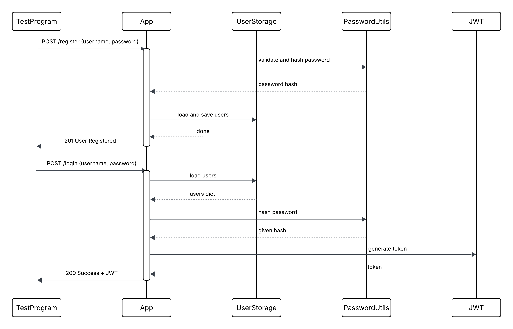

# CS361-Team31-User-Authentication-Microservice

User Authentication microservice for CS361 Team 31.  
Provides user registration and login via REST API using JSON.

---

## DESCRIPTION

This microservice allows a client to:

- Register a new user with a secure password.
- Log in using valid credentials.
- Receive a signed JWT token upon successful login.

The service communicates exclusively via HTTP POST requests using JSON.

---

## INSTALLATION

Install required packages:

```bash
pip install flask pyjwt
```

Run the application:

```bash
python app.py
```

The service runs on:

```
http://127.0.0.1:5000
```

---

## HOW TO REQUEST DATA

All requests must:
- Use HTTP POST
- Include header: `Content-Type: application/json`
- Include a JSON body

### POST /register

Required JSON fields:
- `username` (string, must be unique)
- `password` (string)
  - Minimum 8 characters
  - At least one uppercase letter
  - At least one lowercase letter
  - At least one symbol

Example request:

```bash
curl -X POST http://127.0.0.1:5000/register \
-H "Content-Type: application/json" \
-d "{\"username\":\"testuser\",\"password\":\"StrongPassword123@\"}"
```

---

### POST /login

Required JSON fields:
- `username` (string)
- `password` (string)

Example request:

```bash
curl -X POST http://127.0.0.1:5000/login \
-H "Content-Type: application/json" \
-d "{\"username\":\"testuser\",\"password\":\"StrongPassword123@\"}"
```

---

## HOW TO RECEIVE DATA

All responses are returned in JSON format.

### /register responses

Success (201 Created):

```json
{
  "status": "success",
  "message": "User registered"
}
```

Failure (400 Bad Request):

```json
{
  "status": "error",
  "message": "Invalid JSON"
}
```

```json
{
  "status": "error",
  "message": "Missing username or password"
}
```

```json
{
  "status": "error",
  "message": "Password does not meet requirements"
}
```

```json
{
  "status": "error",
  "message": "Username already exists"
}
```

---

### /login responses

Success (200 OK):

```json
{
  "status": "success",
  "token": "<jwt_token_string>"
}
```

Failure (400 Bad Request):

```json
{
  "status": "error",
  "message": "Invalid JSON"
}
```

```json
{
  "status": "error",
  "message": "Missing username or password"
}
```

Failure (401 Unauthorized):

```json
{
  "status": "error",
  "message": "Invalid credentials"
}
```

---

## TEST PROGRAM

To test using the provided test client:

1. Run the microservice:

```bash
python app.py
```

2. In a separate terminal, run:

```bash
python test_client_auth.py
```

The test program sends POST requests to `/register` and `/login` and prints the JSON responses returned by the microservice.

---

## UML SEQUENCE DIAGRAM

The diagram below illustrates how a Test Program sends POST requests to the Authentication Microservice and how the microservice processes and returns responses.
